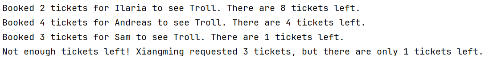
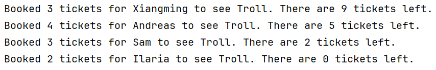
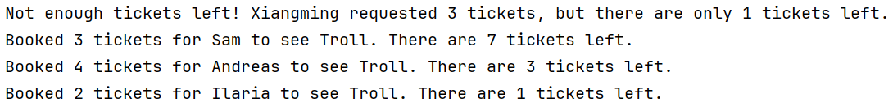
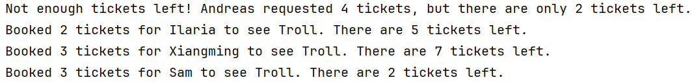

# Movie Ticket Booking

## Description
This is a simple movie ticket booking system.
The system is designed to simulate 4 customers ordering tickets for a movie at once, using threads.
The goal is to demonstrate the use of synchronization and thread management in Java,
and to experiment with the use of the `volatile` keyword.

## How to Run
To run the program, simply run the `Main` class.

## Our Responsibilities
Chris was in charge of `MovieTicketServer`, while Mona was responsible for `MovieTicketClient`.
The `Main` class was taken from the assignment description, and was not modified.'

We ran the project for all three cases together,
and discussed the expected results and actual results.

## Our Observations
In the current implementation (the final, handed-in version), the MovieTicketServer-class is thread-safe,
with the `syncronized` keyword used. 

Below you can read about our experiments with the keywords and what we observed.

### Synchronized
While the value of `availableTickets` updates correctly, the order of bookings is unpredictable. 
Since customers are in total trying to book **12** tickets when only **10** are available,
one customer will always miss out. Who that is depends entirely on the order in which the threads execute.

However, we consider this to be correct, as the number of tickets booked will never exceed the number of tickets available,
and the number of tickets left will only wary between 0, 1, and 2, with one customer always being left out.

Below is an example result of running the program with the `synchronized` keyword:

If we increase the number of available tickets to **12**, all customers will be able to book tickets, and we
can see that the value of `availableTickets` will always be 0 at the end of the program,
and decrease as expected during the running of the program:

### Volatile
We removed the `synchronized` keyword from the `MovieTicketServer` class and replaced it with the `volatile` keyword for the
`availableTickets` variable. However, this caused issues because volatile only ensures that all threads see the most
recent value of `availableTickets`, but it does not make operations on the variable atomic. An atomic operation is one
that is completed as a single, indivisible step, meaning it cannot be interrupted by other threads.
Since operations like `availableTickets--` involve multiple steps (reading, modifying, and writing the value),
race conditions can still occur when multiple threads try to decrement the variable simultaneously.
This can lead to incorrect ticket counts or lost updates.

Below is an image of our results when using the `volatile` keyword:

### Neither synchronized nor volatile
We next removed the `synchronized` keyword from the `MovieTicketServer` class, and did not use the `volatile` keyword.
This created, as expected, unpredictable and plainly wrong results. See image below:

This happens because multiple threads modify the same variable simultaneously without synchronization.
As a result, one thread may read the variable while another thread is modifying it, leading to inconsistent
or lost updates. Since the changes are not immediately visible to all threads, some may act on outdated values.
This is called a race condition.

#### Note
Parts of this document have been rewritten by ChatGPT to improve readability,
but the structure and content remain the same. All explanations and observations are our own.