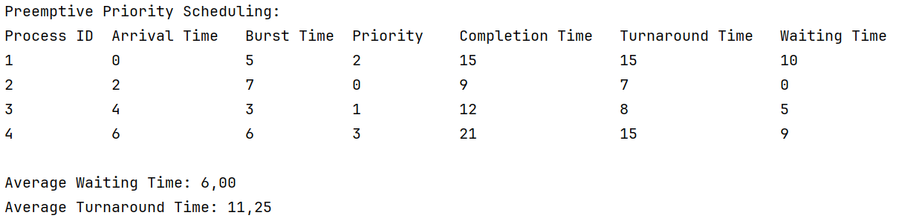
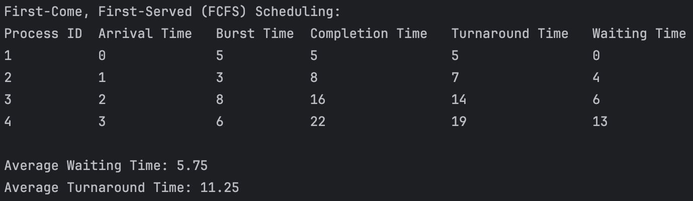
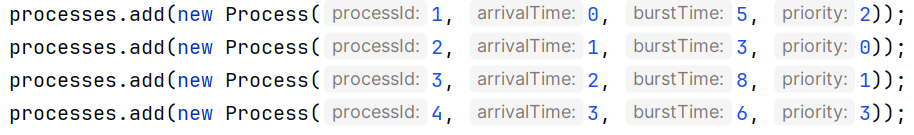
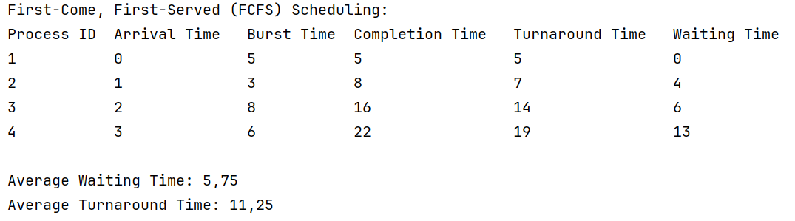
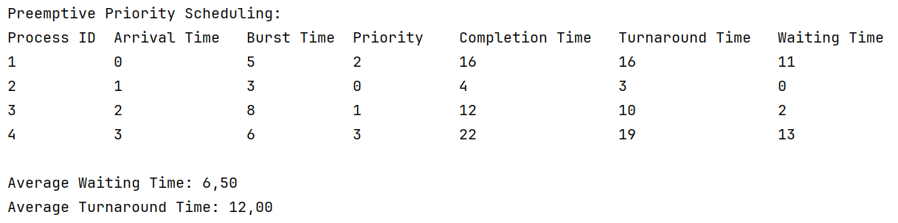

# CPU Scheduling
## Introduction
This is a small project to simulate two CPU scheduling algorithms:
1. Preemptive Priority Scheduling
2. First Come, First Served (FCFS)

## Our Contributions
Chris was in charge of the preemptive priority scheduling algorithm,
while Mona was in charge of the FCFS algorithm.
Chris also created the `Process` class and the `CpuScheduler` class,
but we each created our own methods within that class for our respective algorithms.
Mona also created a simple menu system to choose which algorithm to run.

## How to Run
To run the program, simply run the `main` method in the `CpuScheduler` class.  
A menu will appear, allowing you to choose which algorithm to run:  

Select Scheduling Algorithm:

- **Enter `1`** to run **FCFS**.
- **Enter `2`** to run **Preemptive Priority Scheduling**.
- **Enter `3`** to **exit the program**.

After an algorithm completes, you can **choose again without restarting the program**.

Feel free to modify the methods in `CpuScheduler` to test different scenarios,  
e.g. different burst times, priorities, or arrival times, or to add more processes.

## Preemptive Priority Scheduling
Preemptive scheduling works by assigning each process a priority. If a process with a higher
priority arrives, it will preempt the current process and start executing.
If a process with the same priority arrives, it will be added to the queue.

If you run the main method as is, you will see the following output:

## First-Come, First-Served (FCFS) Scheduling
FCFS works by **executing processes in the order they arrive**.
- Once a process starts, it **runs to completion** without interruption.
- This is a **non-preemptive scheduling algorithm**.

If you run FCFS Scheduling, you will see the following output:  

## Comparison and Conclusion
We'll create 4 processes, and run them with both algorithms to compare the results.
These are the processes (for FCFS, priority is ignored):

These are the outputs:

The results show that the scheduling algorithm will affect the performance of the program
(notice the difference in waiting times and turnaround time).

While the difference isn't huge in this case, as the number of processes increases,
we can expect the average waiting time for the First-Come-First-Served (FCFS) algorithm to be higher
than for the preemptive priority scheduling algorithm. This is because FCFS suffers from the what's called the **convoy effect**,
where shorter processes get stuck waiting behind longer ones, increasing the average waiting time. 
For example, a process with a burst time of 20s could arrive before a process with a burst time of 1s.
The short process must wait 20s even though it could have finished quickly if it had been
scheduled first.

On the other hand, the preemptive priority scheduling algorithm is less likely to let a single process
hold the CPU for its entire duration, as it allows higher-priority processes to interrupt (preempt) lower-priority ones.
This helps reduce long wait times and improves overall efficiency. The preemptive priority scheduling algorithm does suffer from **starvation**,
where low-priority processes may never get a chance to run if higher-priority processes keep arriving, which is a problem that FCFS doesn't have,
and it would need to be addressed, for example by aging (increasing the priority of a process the longer it waits).

For only 4 processes, we can tell it doesn't really matter which algorithm we use.
But as the number of processes increases, the preemptive priority scheduling algorithm would be more efficient.
However, neither algorithm is perfect, and the best choice depends on the specific requirements of the system.
